# Nitro King

__Engine :__ `Unity`

__Additional Softwares :__ `Blender`

__Descriptions :__ A Mario Kart inspired racing game set in a cityscape

---

Custom Assets :

> Created assets with the Low-Poly aesthetics to fit theming

   
   
   
   
   

   
   

> Adding light source to assets

   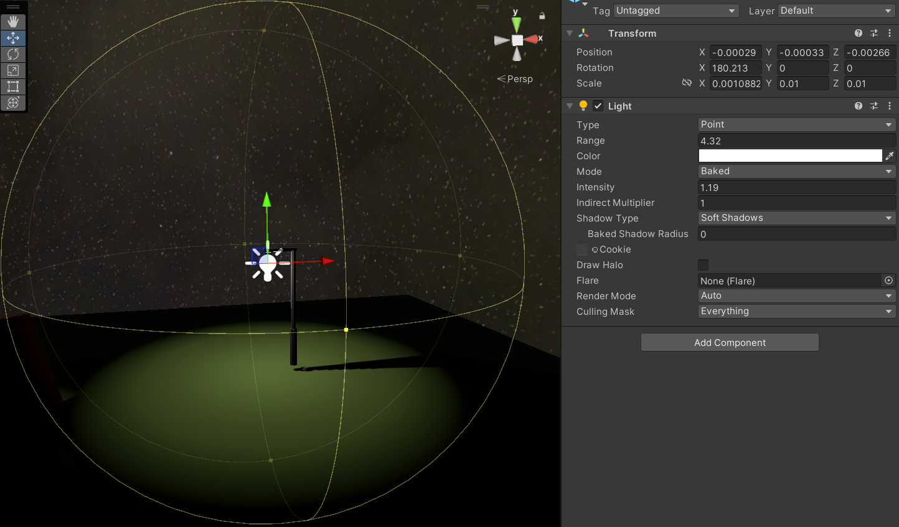
   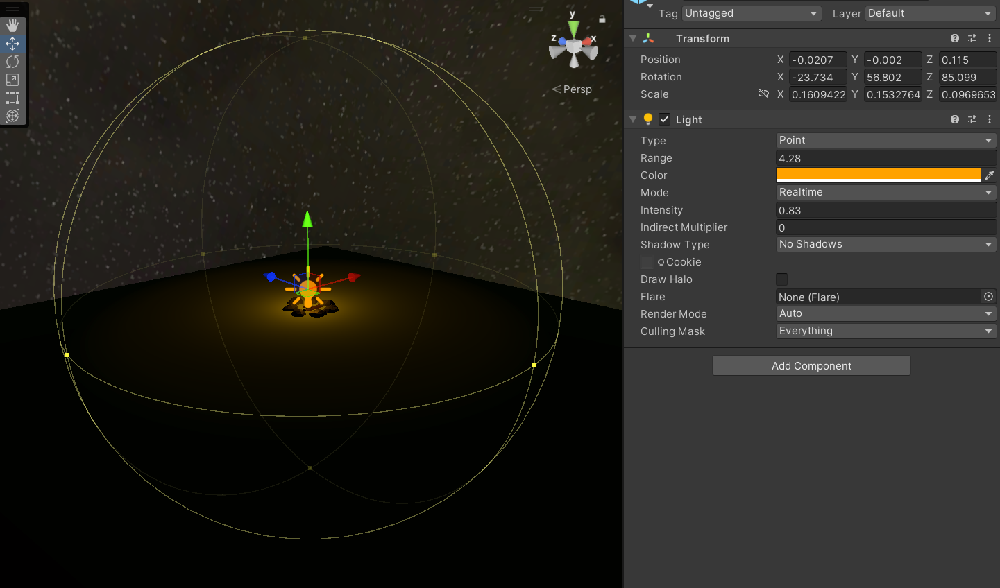

Planning and Segmentation of Districts :

> Segmentation of districts with unique themes assigned to each

   
   
   
   
   
   

Audio Track Implementation :

> Creating and adding audio tracks ( BGM & SFX ) to Projects

   
   

Miscellaneous Changes:

   <ol>
      <li> Added headlights to vehicles to illumate path ahead 
         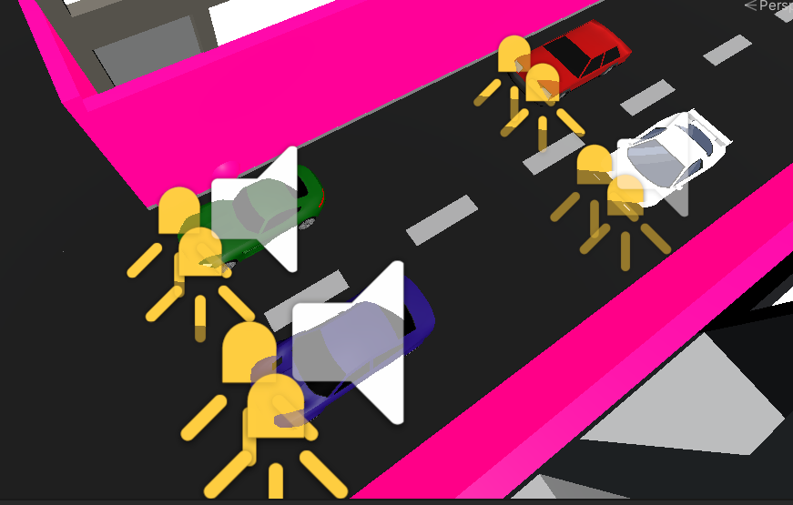 </li>
      <li> Added invisible barrier to prevent out of bounds [ Is currently bright pink, but will be unrendered upon runtime ]
         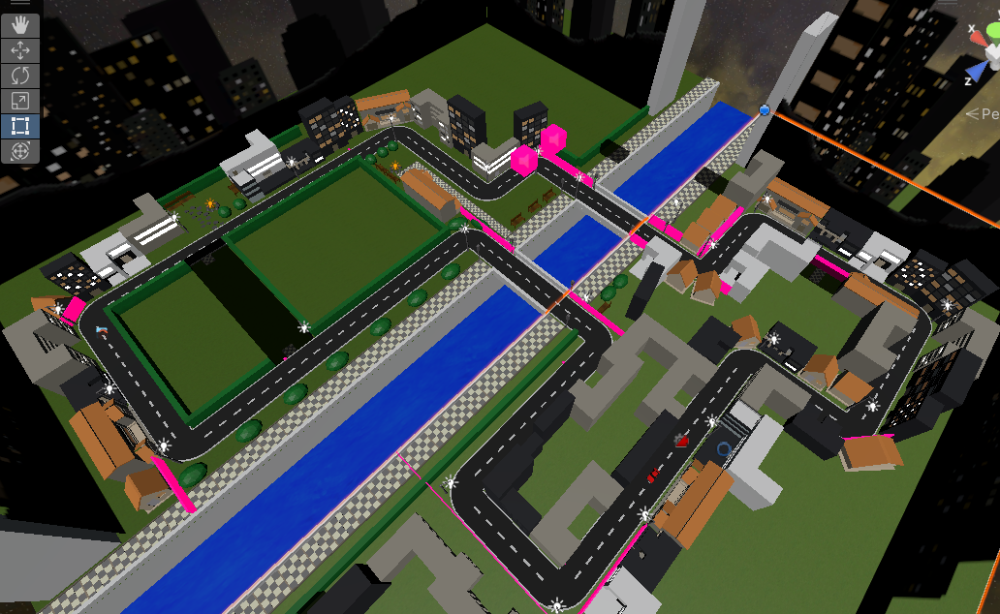 
         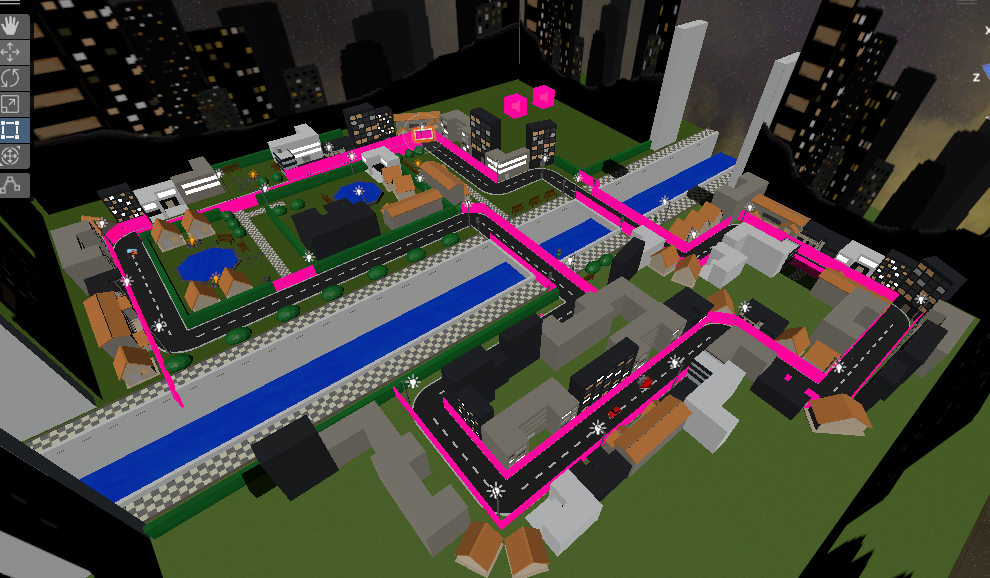 </li>
      <li> Added powerup sprites
         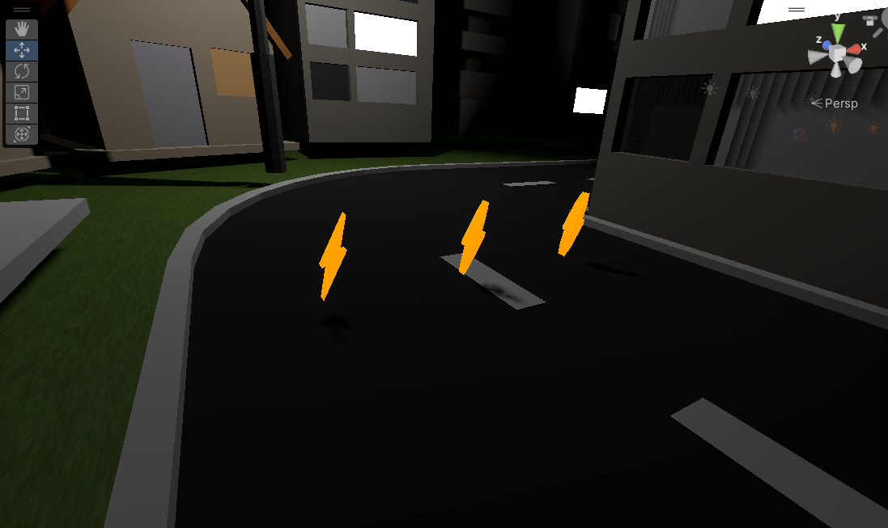 </li>
   </ol>    

Final Circuit on Runtime:

   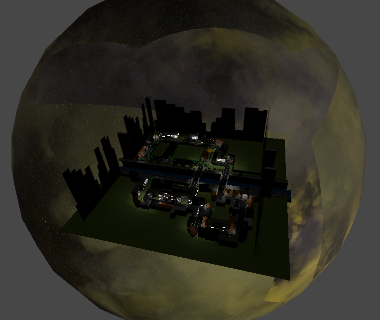

# Galaga-inspired Game

__Framework :__ `PyGame`

__Additional Resources/Libraries :__ `pygame_starter`

__Descriptions :__ A multiplayer Galaga inspired game

---

Created Sprites :

> Created spites and complied into spritesheets

   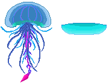  
   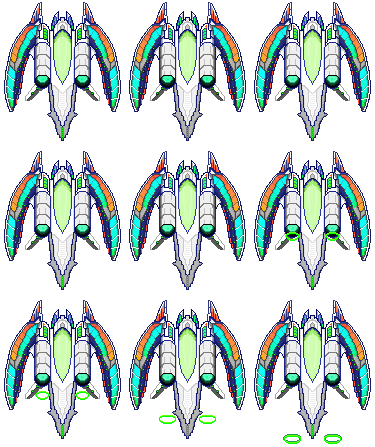  
   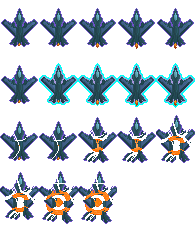  
   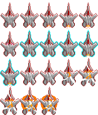   
   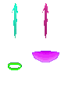  
     
   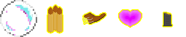

